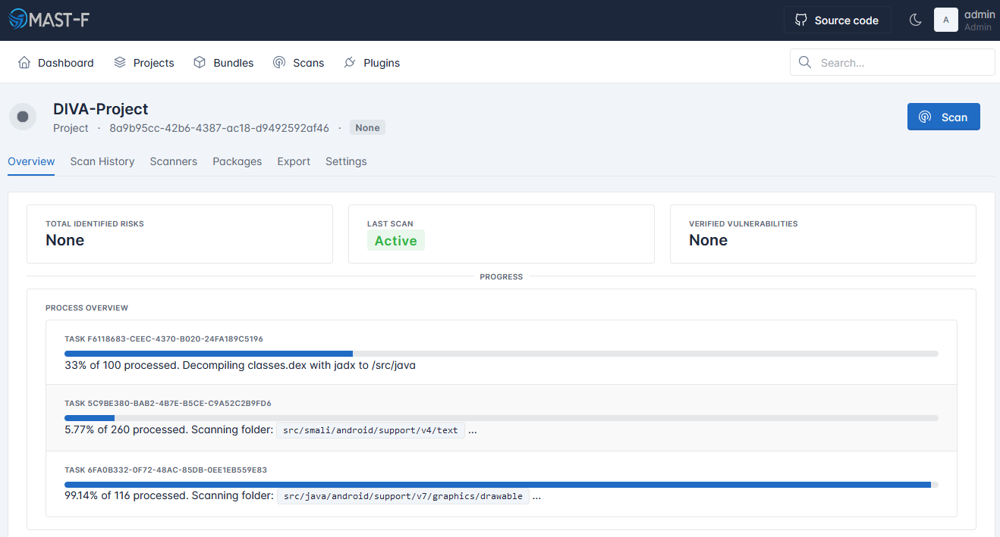
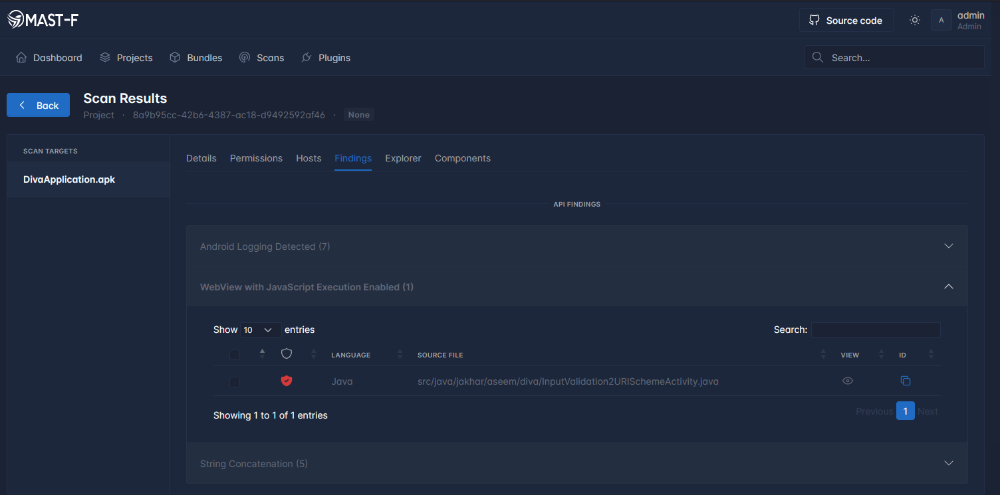
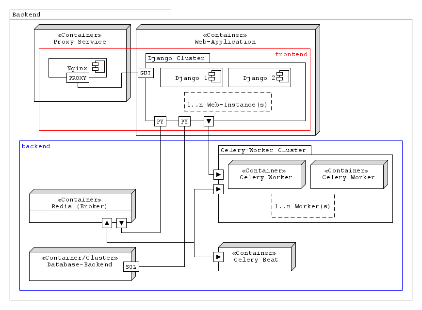

# Mobile Application Security Testing Framework (MAST-F) for iOS and Android

[](https://www.python.org/downloads/)
&color=teal)


[](https://github.com/MASTFramework/mastf/actions/workflows/python-sphinx.yml)


<a href="https://github.com/MASTFramework">

</a>

MAST-F is a comprehensive Mobile Application Security Testing Framework designed to test the security of iOS and Android mobile applications. It provides a wide range of tools and features to identify vulnerabilities and weaknesses in mobile apps, helping developers and security professionals ensure the robustness and integrity of their applications.

> [!IMPORTANT]
> This software is in *alpha* status and is NOT stable. It is intended for testing purposes only. Please use with caution and expect bugs and frequent changes.

## Documentation & Help

The documentation for MAST-F is available on [Github-Pages](https://mastframework.github.io/ mastf/). It contains detailed information about the framework, its usage, configuration options, and various testing techniques. We highly recommend referring to the documentation to get started with MAST-F. Please visit the [Discussions](https://github.com/orgs/MAST-Framework/discussions) tab to ask questions or get help.

## Key Features

+ **User Management**: MAST-F provides user management functionality with different roles. This allows for secure access and control over the framework's features and capabilities based on user privileges.

    

+ **Distributed Scan Tasks**: The framework supports the distribution of scan tasks across multiple machines or devices. This allows for efficient and faster scanning of mobile applications, reducing the overall testing time.

+ **Multiple Scans at a Time**: MAST-F enables the execution of multiple scans simultaneously using the [Celery](https://docs.celeryq.dev/en/stable/getting-started/introduction.html) framework. This feature enhances productivity by allowing users to test multiple mobile applications concurrently.

    

+ **Analysis for Android and** `[proposed]` **iOS Apps**: The framework supports comprehensive security analysis for both Android and iOS applications. It includes a range of techniques and tools specific to each platform, ensuring thorough testing and identification of vulnerabilities.

+ `[proposed]` **Export to PDF using Pre-defined Templates**: MAST-F offers the ability to export scan reports to PDF format. It provides pre-defined templates based on Word or HTML, allowing users to generate professional and standardized reports for their security assessments.

+ **Visual Comfort**: With DarkMode support, MAST-F transforms its interface into a visually soothing dark theme, reducing the glare emitted by traditional light interfaces.

    

+ **Support for Project Bundling**: The framework includes support for bundling multiple projects together. This feature enables users to create a bundle of related projects, providing a centralized view for more in-depth analytics and reporting.

These key features make MAST-F a versatile and powerful Mobile Application Security Testing Framework, facilitating effective testing, analysis, and reporting of security vulnerabilities in iOS and Android applications.

## Project Architecture



The above diagram provides an overview of the MAST-F project architecture. It showcases the different components and their interactions within the framework.

## Setup

To set up MAST-F, please follow the instructions provided in the documentation on [Github Pages](https://mastframework.github.io/ mastf/). The setup process involves configuring the required dependencies and performing necessary configurations before running the containers. You can find the setup commands and detailed guidelines on the documentation page. To simply run the containers, just execute
```bash
./bin/webui.sh [-d]
```

## Contributing and Questions

We welcome contributions from the community to improve MAST-F. If you have any questions, suggestions, or bug reports, please visit the [Discussion](https://github.com/orgs/MAST-Framework/discussions) tab in the repository. Feel free to engage in discussions, ask questions, and share your experiences with the framework.

## Reporting Security Issues

If you discover any security vulnerabilities or issues in MAST-F, please report them to us immediately. You can submit security-related concerns or vulnerabilities by sending an email to [security-mastf[at]proton.me](mailto:security[at]mast-framework.com). We appreciate your responsible disclosure and will address the issues as quickly as possible.

## License

MAST-F is licensed under the MIT License. For more details, please refer to the [LICENSE](LICENSE) file in this repository.
