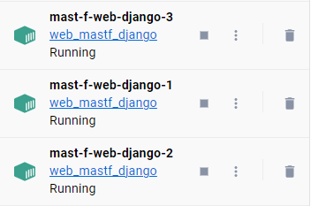

.. _intro_scaling:

************************
Scaling Container Images
************************

Docker Compose is a tool for defining and running multi-container Docker
applications. It provides a simple way to configure and launch multiple
containers that work together to provide a complete application. Scaling
container images with Docker Compose is a great way to increase the
availability and performance of an application by running multiple instances
of the same container. On this page, we will show you how to scale both
Celery worker instances and Django application containers using Docker
Compose.

Scaling Django Application Containers
-------------------------------------

To scale Django application containers using Docker Compose, we need to
define our application services in a docker-compose.yml file. Take a look at
the docker-compose.yml file that defines our Django application container:

.. code-block:: yaml

    # Web instance will run in a separate container and should establish
    # connections to Celery, Redis and the backend DB while running.
    web-django:
        build:
            context: ./
            dockerfile: ./compose/local/django/Dockerfile

        image: web_mastf_django
        command: /start
        env_file:
            - ./.env

        volumes:
            - type: bind
                source: ./
                target: /app

            - storage_data:/app_storage
        expose:
            - 8000

        depends_on:
            - redis
            - backend-db

        networks:
            - frontend
            - backend

To scale our Django application container, we can simply run the following
command:

.. code:: bash

    $ docker compose up -d --scale web-django=<number of containers>

This command will launch three instances of the ``web-django`` service, each running
on the same port. As a Load Balancer we use nginx, which automatically will handle
mutliple Django instances. You should see the amount of applications you wanted to
scale:

    Figure 1: Three web instances running at the same time. They will be communicating
    automatically with the nginx instance on incoming requests.

Scaling Celery Worker Instances
-------------------------------

To scale Celery worker instances using Docker Compose, we  define our application services
in the docker-compose.yml file and use the celery command to launch the worker processes.
Scaling is as easy as described above with Django application servers:

.. code-block:: bash

    $ docker compose up -d --scale celery_worker=<number of workers>

.. hint::
    Why does this command scale our application horizontally?

    In a typical Celery setup, tasks are sent to a message broker, such as RabbitMQ or Redis,
    by the Celery application. The message broker then delivers the tasks to worker processes,
    which execute the tasks and return the results back to the application. Using multiple
    worker instances result in distributed task management and execution. Each worker will
    execute a task when its ready.

Conclusion
----------

On this page, we've covered the process of scaling container images with Docker Compose, focusing
on scaling multiple Celery worker instances that communicate with Redis as their message broker. By
following these steps, you should be able to scale your Django application and Celery worker instances
with ease, enabling your application to handle increased traffic and workload.

Let's sum up, you can scale your project instance with the following commands:

.. code:: bash

    $ docker compose up -d --scale web-django=<number of containers> --scale celery_worker=<number of workers>