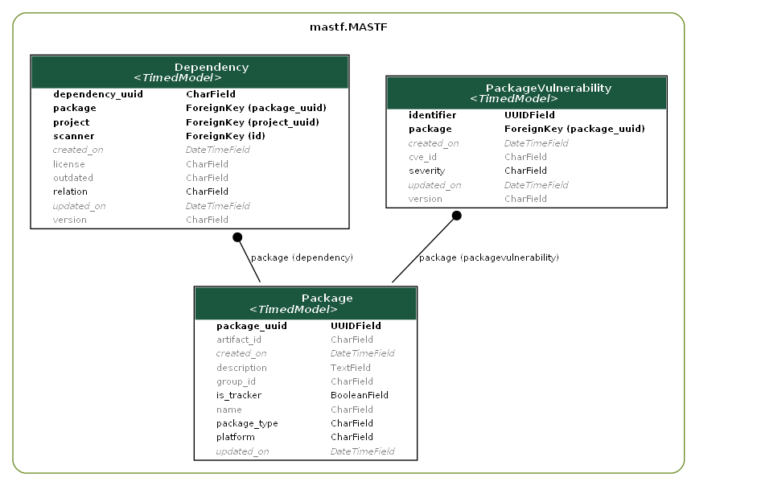

.. _guide_package_models:

*****************
Dependency Models
*****************

This document provides a comprehensive documentation for the Python classes :class:`Package`,
:class:`PackageVulnerability`, and :class:`Dependency`. These classes are used in the context
of software package management and vulnerability detection. The :class:`Package` class represents a
software package, while :class:`PackageVulnerability` represents a vulnerability associated with a
package. The :class:`Dependency` class represents a dependency between an app and a package.

    Figure 1: Overview of models related to software packages and project dependencies

.. autoclass:: mastf.MASTF.models.Package
    :members:
    :exclude-members: MultipleObjectsReturned, DoesNotExist

.. autoclass:: mastf.MASTF.models.PackageVulnerability
    :members:
    :exclude-members: MultipleObjectsReturned, DoesNotExist

.. autoclass:: mastf.MASTF.models.Dependency
    :members:
    :exclude-members: MultipleObjectsReturned, DoesNotExist

The :class:`Dependency` class also has a ``vulnerabilities`` property, which returns a queryset with
all vulnerabilities associated to the package and version of the dependency.