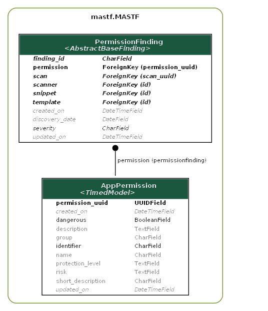

.. _guide_models_permission:

*********************
App Permission Models
*********************

The following models should be used to add extracted permissions to an app. Each app
permission will be represented by an object of :class:`AppPermission` which will then
be mapped to a :class:`PermissionFinding` instance. With that model, we have to create
the app permissions only once and just have to mapp them to scans.

    Figure 1: App-Permissions that can be created on the plugin page of each MAST-F instance
    will be mapped to a finding.

.. autoclass:: mastf.MASTF.models.AppPermission
    :members:
    :exclude-members: MultipleObjectsReturned, DoesNotExist

.. autoclass:: mastf.MASTF.models.PermissionFinding
    :members:
    :exclude-members: MultipleObjectsReturned, DoesNotExist
